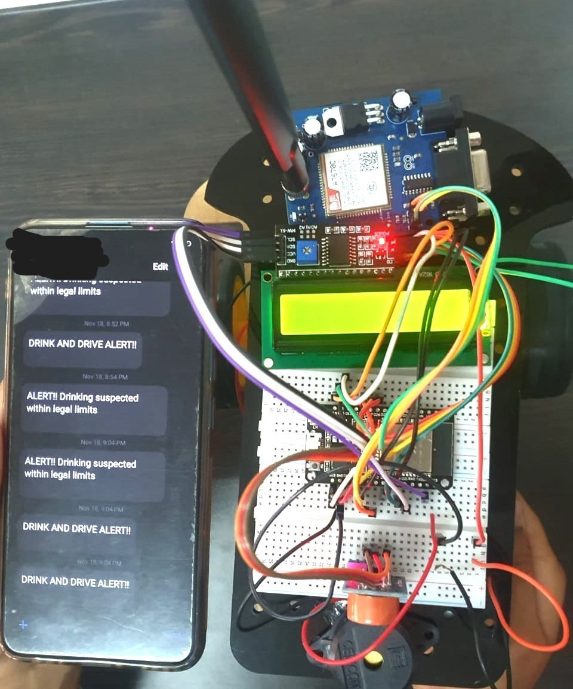
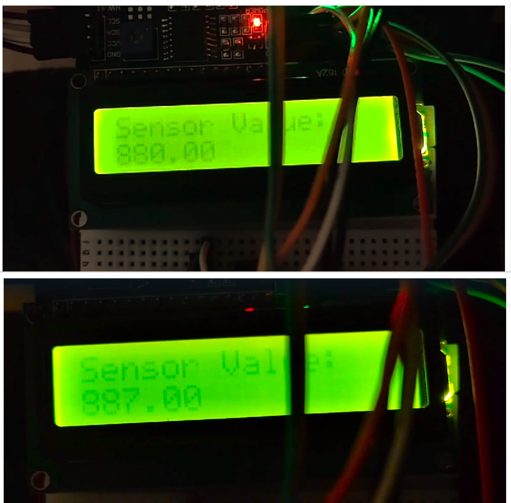
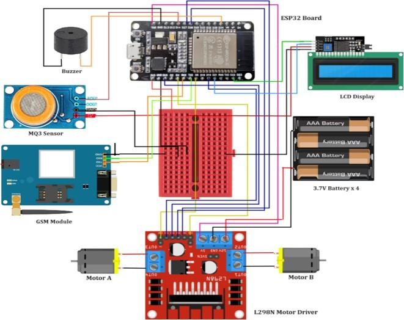

# ESP32 Alcohol Detection & Motor Locking System

An embedded safety system that monitors driver alcohol concentration in real time, progressively reduces vehicle speed, locks the motor on confirmed drunk-driving detection, and sends SMS alerts via a 4G GSM module.

Built as part of an MSc in Automotive Embedded Systems (ESIGELEC / Muthoot Institute of Technology and Science, 2023).

---

## Demo

| State | Sensor Value | Behaviour |
|---|---|---|
| Sober | < 600 | Full speed, no alert |
| Warning | 600 – 999 | 50% speed, buzzer + LED on, SMS sent |
| Drunk | ≥ 1000 | Motor lock, buzzer + LED on, SMS sent |

SMS alerts received on guardian's phone:



MQ-3 sensor values displayed live on LCD:



Final prototype:



---

## System Architecture

```
MQ-3 Sensor ──→ ESP32 ──→ L298N Motor Driver ──→ DC Motors (A & B)
                  │
                  ├──→ 16x2 I2C LCD (real-time BAC reading)
                  ├──→ Buzzer + LED (local alert)
                  └──→ A7670C 4G GSM Module ──→ SMS to guardian
```

---

## Hardware Components

| Component | Role |
|---|---|
| ESP32 Dev Module | Central MCU — sensor reading, decision logic, motor + GSM control |
| MQ-3 Alcohol Sensor | Detects ethanol vapour via chemiresistive SnOâ‚‚ sensing element |
| A7670C 4G GSM Modem | Sends SMS alerts via AT command interface over UART2 |
| L298N Motor Driver | H-bridge PWM motor control for speed gradation and motor lock |
| 16x2 I2C LCD | Real-time display of sensor ADC value and system state |
| Buzzer + Red LED | Local alert to surrounding vehicles |
| GPS Module (NEO-6M) | Location tracking (integrated in design; see Known Issues) |

---

## Pin Mapping

| Signal | ESP32 GPIO |
|---|---|
| MQ-3 Analog Out | 14 |
| Motor A IN1 / IN2 | 26 / 27 |
| Motor A Enable (PWM) | 4 |
| Motor B IN3 / IN4 | 15 / 19 |
| Motor B Enable (PWM) | 5 |
| GSM TX / RX (UART2) | 17 / 16 |
| Buzzer | 23 |
| LED | 22 |
| LCD (I2C SDA/SCL) | Default I2C pins (21/22) |

---

## Getting Started

### Prerequisites

- Arduino IDE 2.x with ESP32 board support installed
  - Board manager URL: `https://raw.githubusercontent.com/espressif/arduino-esp32/gh-pages/package_esp32_index.json`
- Libraries (install via Library Manager):
  - `LiquidCrystal_I2C` by Frank de Brabander
  - `HardwareSerial` (bundled with ESP32 core)

### Configuration

Before flashing, open `firmware/alcohol_detection_motor_lock.ino` and set your recipient phone number:

```cpp
#define RECIPIENT_NUMBER "YOUR_PHONE_NUMBER"  // e.g. "+919XXXXXXXXX"
```

Adjust thresholds if needed after calibrating your MQ-3 sensor in your environment:

```cpp
#define SOBER_THRESHOLD  600
#define DRUNK_THRESHOLD  1000
```

### Flashing

1. Connect ESP32 via USB
2. In Arduino IDE: select **Board → ESP32 Dev Module**, correct **Port**
3. Open `firmware/alcohol_detection_motor_lock.ino`
4. Click **Upload**
5. Open Serial Monitor at **115200 baud** to view live sensor readings

---

## How It Works

The MQ-3 sensor outputs an analog voltage proportional to ethanol concentration in the surrounding air. The ESP32 reads this via its 12-bit ADC (0–4095 range). Three decision states are evaluated every second:

1. **Sober** (`value < 600`): Motors run at full PWM (255). No alerts.
2. **Warning** (`600 ≤ value < 1000`): PWM reduced to 127 (~50% speed). Buzzer and LED activated. SMS sent to guardian's number via AT+CMGS command.
3. **Drunk** (`value ≥ 1000`): Speed ramped to 50, then `stopMotors()` cuts PWM to zero on both L298N channels. Buzzer and LED remain active. DRUNK alert SMS sent.

GSM communication uses the standard AT command set over UART2 at 115200 baud. The A7670C module handles network registration and SMS delivery independently once the AT commands are issued.

---

## Known Issues / Limitations

- **GPS not functional in prototype**: The NEO-6M GPS module encountered signal acquisition issues during indoor testing. Location tracking is present in the system design but was not achieved in the physical prototype.
- **MQ-3 cross-sensitivity**: The sensor responds to other VOCs (methane, propane, acetone). Threshold calibration in a controlled environment is recommended before deployment.
- **ADC non-linearity**: ESP32's ADC is known to have non-linearity at the extremes. For production use, external ADC or voltage divider correction is advised.
- **SMS rate limiting**: No debounce on SMS sending — repeated alerts fire every loop iteration while the state persists. A cooldown timer should be added for production.

---

## Future Improvements

- Add SMS cooldown timer to prevent alert spam
- Integrate GPS location into SMS payload
- Calibrate MQ-3 against known BAC values for accurate mg/L output
- Add FreeRTOS tasks to separate sensor polling from GSM communication
- Implement MQTT over 4G for cloud-based fleet monitoring

---

## Project Report

Full project report (hardware design, literature review, methodology) available in [`docs/project_report.pdf`](docs/project_report.pdf).

---

## Author

**Rosmia Jose**  
MSc Automotive Embedded Systems — ESIGELEC, Rouen / Muthoot Institute of Technology and Science  
[LinkedIn](https://www.linkedin.com/in/rosmia-jose) · [GitHub](https://github.com/rosmia-jose)

---

## License

MIT License — see [LICENSE](LICENSE) for details.
